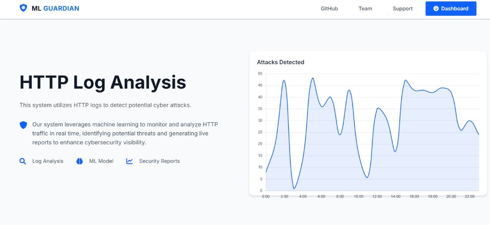
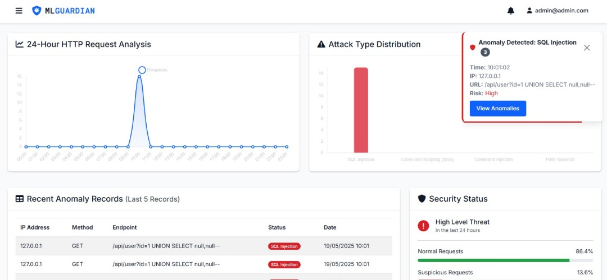
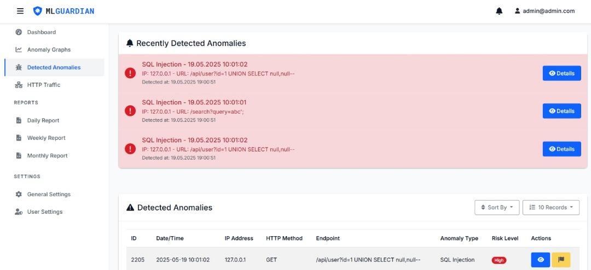
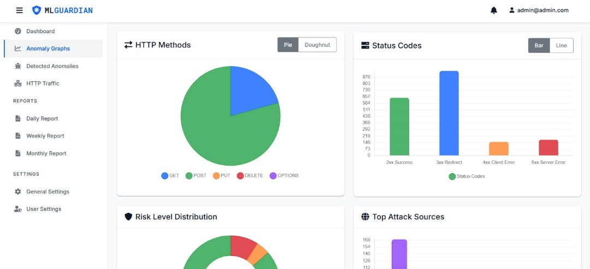
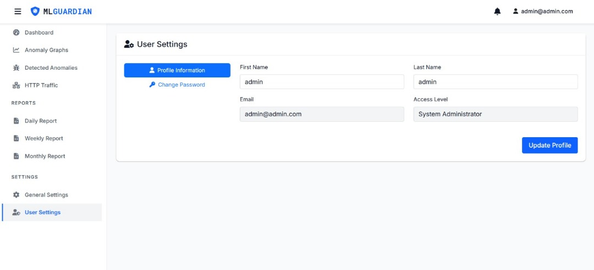
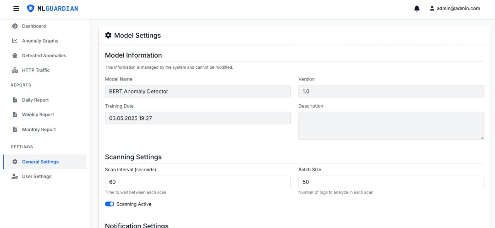

# 🔐 MLGuardian – AI-Powered Cyber Attack Detection System

**MLGuardian** is an AI-powered live monitoring system designed to detect and classify web-based cyber attacks using HTTP logs. It leverages a fine-tuned LogBERT model to identify anomalies with a high level of accuracy and presents them through a modern, user-friendly dashboard.



---

## 📌 Key Features

- ⚙️ Real-time HTTP log monitoring  
- 🤖 AI-based anomaly detection using **LogBERT**  
- 📊 Interactive dashboard for viewing anomalies  
- 🔐 Admin authentication system  
- 📂 Reports (Daily, Weekly, Monthly)  
- 🧪 Supports detection of:
  - SQL Injection
  - Cross-Site Scripting (XSS)
  - Command Injection
  - Path Traversal

---

## 🧠 How It Works

1. **Log Parsing**  
   HTTP logs are parsed and cleaned to extract relevant fields like IP, method, endpoint, etc.

2. **Model Processing**  
   A fine-tuned **LogBERT tokenizer-based model** classifies the request as normal or malicious.

3. **Live Display**  
   Detected attacks are visualized in real time on the dashboard.

4. **Reporting and Access Control**  
   Secure admin login and anomaly reporting via Django and PostgreSQL.

---

## 📸 UI Snapshots

### 📊 Dashboard View


### 🧬 Anomaly Breakdown


### 🧾 Reports & Analytics


### 👤 Admin Profile Management


### ⚙️ Model Settings Panel


---

## 🛠 Tech Stack

| Layer         | Technology              |
|---------------|--------------------------|
| **ML Model**  | LogBERT, PyTorch         |
| **Backend**   | Django, Python, PostgreSQL |
| **Frontend**  | Tailwind CSS, HTML, JS   |
| **Deployment**| Docker & Docker Compose    |

---

## 🔧 Getting Started

### 1. Clone the Repository

```bash
git clone https://github.com/furkanpnr/mlguardian.git
cd mlguardian
```


### 2.  Environment Configuration
Before running the project, copy the example environment file and configure your settings:

```bash
SECRET_KEY=<your-django-secret-key>
DEBUG=True
ALLOWED_HOSTS=localhost,127.0.0.1

# CORS Configuration
CORS_ALLOW_ALL_ORIGINS=False
CORS_ALLOWED_ORIGINS='http://localhost:3000'
CSRF_TRUSTED_ORIGINS='http://localhost:8000'

# Use SQLite for local dev or PostgreSQL for production
USE_POSTGRES=False

# PostgreSQL Config (used when USE_POSTGRES=True)
POSTGRES_DB=mlguardian_db
POSTGRES_USER=mlguardian_user
POSTGRES_PASSWORD=securepassword
POSTGRES_HOST=db
POSTGRES_PORT=5432

# Log format type: 'apache' or 'nginx'
LOG_TYPE=apache

# Path to the HTTP log file to be scanned
HTTP_LOG_PATH=/app/logs/access.log

```


### 3.  Build and Run with Docker Compose

```bash
docker-compose up --build
```
This will:

- Build the Django app

- Set up PostgreSQL

- Run migrations
 
- Start the server on http://localhost:8000


### 4. Create Superuser

```bash
docker exec web python manage.py createsuperuser
```

### 5.  Access the Application

Once running, open your browser and go to:

- Main Dashboard: http://localhost:8000
- Admin Panel: http://localhost:8000/admin


## 📈 Performance
Achieved ~99% accuracy on fine-tuned LogBERT for detecting malicious HTTP requests using the [apache-http-logs](https://github.com/ocatak/apache-http-logs) dataset.
